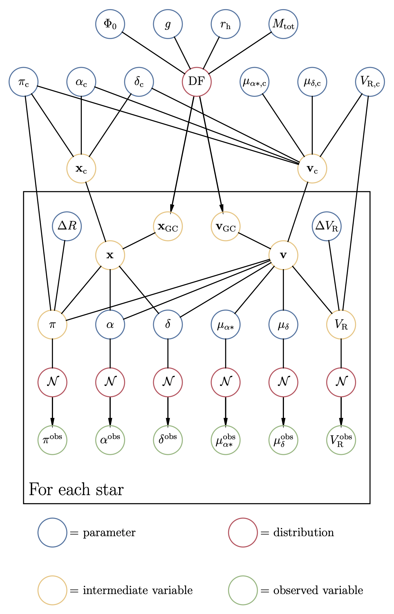

# Week 46
## Mon, 6 Nov

>今日陆老师名言 ： 我不在乎这个工作能不能发nature，我做得开心就行 🐶 

- [Filamentary structures as the origin of blazar jet radio variability](https://arxiv.org/abs/2311.01861) Antonio Fuentes, José L. Gómez, José M. Martí
	- **status** : Initial version of an article published in **Nature Astronomy**
	- **summary** : 观测文章，用了更高精度的数据，推翻了标准的 shock-in-jet model 中多普勒因子为常数的假设，发现喷流中的发射特征可能是由变化的 Doppler-boosting 带来的。
	- **key sentence** : high angular resolution and dynamic range image, suggests that **emission features traveling down the jet** may manifest as a result of **differential Doppler-boosting within the filaments**, **as opposed to the standard shock-in-jet model invoked to explain blazar jet radio variability**.
	- **Data** : **microarcsecond-scale angular resolution** images of the **blazar 3C 279** obtained at 22 GHz with the space **VLBI**(very long baseline interferometric) mission RadioAstron

 - [Core-collapse supernova inside the core of a young massive star cluster: 3D MHD simulations](https://arxiv.org/abs/2311.01789) D. V.  Badmaev, A. M. Bykov, M. E. Kalyashova
	- **subjects** : High Energy Astrophysical Phenomena (astro-ph.HE)
	-  **background** : 在星团形成的几百万年后，年轻大质量恒星可能以核坍缩超新星的形式结束演化，超新星的 blast wave 在星团内部区域以年轻亮星的多重恒星风形式传播。
	- **summary** : present the results of **3D magnetohydrodynamic simulations**(三维磁流体动力学模拟) of the **plasma flows by a supernova event** inside a cluster similar to **Westerlund 1**, followed its evolution over a few thousand years(a few shock crossing time), found the plasma tempreture, density and magnetic field are highly distributed by supernova event.

- [The metallicity variations along the chromosome maps: The Globular Cluster 47 Tucanae](https://arxiv.org/abs/2311.01871) A. F. Marino, A. P. Milone, E. Dondoglio
	- **background** : 
		- 球状星团多星族问题, the "chromosome maps" (ChMs) of globular clusters (GCs)。In Type II GCs, display larger variations, sometimes coupled with slow neutron caputure (s) 慢中子俘获 (s 过程) element enrich on the ChMs redder sequences, which has been interpreted as due to multiple generations of stars. 但大部分 GC 在第一代星族形成时 (first populations, 1P)， 就有较大的$\Delta_{F275W},\Delta_{F814W}$，表明形成恒星的原始分子云本身就不是混合均匀的。
		- Tucanae : 杜鹃座
	- **summary** : analyse the chemical composition the **GC 47 Tucanae**, shows **1P stars are not homogeneous** with metallicity variations ~0.1 dex, **no evidence** for a sigificant **enrichment in the s elements** with the anomalous stars distributed on a redder sequences of the ChM.

- [Nebular dominated galaxies in the early Universe with top-heavy stellar initial mass functions](https://arxiv.org/abs/2311.02051) Alex J. Cameron, Harley Katzm, Callum Witten
	- **status** :  submitted to **Nature**
	- **background** : 随着 JWST 的发射，人们开始研究早期宇宙的恒星形成问题。在早期宇宙的高气体压力和低金属丰度下，恒星初始质量函数(IMF)会是什么样的呢？IMF 影响了星系的几乎所有观测特性， 控制了恒星如何影响星系生长，所以 IMF 在星系形成领域也是至关重要的。
	- **summary** : report the detection of **two Lyman-$\alpha$-emitting galaxies** in the Epoch of Reionization with **exceptionally top-heavy IMFs**, analysis of **JWST/NIRSpec** data demonstrates that these galaxies exhibit spectra which are completely dominated by the nebular continuum, observe a steep turnover in the ultraviolet continuum. Instead of a contrived damped Lyman-$\alpha$-absorption model, we show this feature is **two-photon emission from neutral hydrogen** (which can only dominate if the ionizing emissivity is $\geq 10 \times$ that of a typical star-forming galaxy). 
	- **key** : Found such radiation fields can be produced in star clusters dominated by low-metallicity stars of $\geq 50 M_{\odot}$, where the IMF is $10 - 30 \times$ **more top-heavy** than typically assumed.

## Tue, 7 Nov
- [Parameter Estimation for Open Clusters using an Artificial Neural Network with a QuadTree-based Feature Extractor](https://arxiv.org/abs/2311.03009) L.Gavallo(2021-2024, PhD in Università degli Studi di Padova), G. Carraro, L. Magrini
	- **status** : accepted in AJ
	- **summary** : develop a ANN trained on synthetic clusters to estimate **age, metallicity, extinction and distance** of **Gaia** open clusters, extract features  using **QuadTree** tool and adopt a multi-band approach, obtain reliable parameters for [~5400 clusters](https://phisicslollo0.github.io/cavallo23.html).
	- **why ANN not CNN ?** ANN maintains the **full positinal information** and have better performance for this work.

## Wed, 8 Nov
- [Hierarchical Bayesian Inference of Globular Cluster Properties](https://arxiv.org/abs/2311.03704) Robin Y. Wen, Joshua S. Speagle, Jeremy J. Webb
	- **summary** :  Bansed on **lowered isothermal cluster models**, present a **hierarchical bsyesian model** to estimate the structural properties and the phase space center (相空间中心) of a globular cluster (GC). First build a lowered isothermal distribution function using interpolation to provide realiable gradient information for **Hamiltoian Monte Carlo methods** (HMC) to sample large bayesian models (hundreds of parameters).
	- **advantage** : avoids the common techinique of radial binning, try to explore hierarchical bayesian model to address issues including the unknown GC center, incomplete data and measurement errors.
	- **model** : 

- [Why Galaxies are Indeed Simpler than Expected](https://arxiv.org/abs/2311.03632) Jun-Sung Moon, Jounghun Lee
	- 由于宇宙中星系的不同的合并历史、随机恒星形成以及纤维环境的多尺度影响 (multi-scale influences of filamentary environments)，我们很难想象早期宇宙存在**单一初始条件**能够单独解释星系的形成及演化。但观测研究发现，局部宇宙中观测到的星系的关键物理特征似乎收到单一因素调控，本工作将这一单一因素确定为初始潮汐场与原星系惯性动量张量之间的错位程度 (**degree of misalignments between the initial tidal field and protogalaxy inertia momentum tensors**)。通过 **IllustrisTNG** 验证了这一猜想，认为宇宙学初始条件对星系演化的影响比人们通常认为的要大得多。

- [Galaxy Spectra neural Network (GaSNet). II. Using Deep Learning for Spectral Classification and Redshift Predictions](https://arxiv.org/abs/2311.04146) Fucheng Zhong(中山), Nicola R. Napolitano, Caroline Heneka
	- **summary** : present Galaxy Spectra Network/GaSNet-II, a surpervised multi-network deep learning tool for **spectra classification** and **redshift prediction**. 可以自定义分类数量，优化每个类别中分类对象的红移预测，提供红移误差，使用network-of-networks的方法，能够在每个光谱上重现蒙特卡洛测试。
	- **data** : 
		- **SDSS DR16** (260k), 13 classes (including 140k galactic, 120k extragalactic)
		- **4MOST** mock spectra (200k)
		- **DESI** spectra (21k)
	- **capability** : process ~40k spectra in less than one minute (normal desktop GPU)

## Thu, 9 Nov
- [The Future of Astronomical Data Infrastructure: Meeting Report](https://arxiv.org/abs/2311.04272) Workshop report in February 2023 on the Future of Astronomical Data Infrastructure
	- 涨知识系列
	- 讨论为了面对天文数据在获取、分析、合并方面的困难，建议一个协调机构，其具体任务是加强天文数据和软件的互操作性、存档、分发和制作(interperability, archiving, distribution, production)。
	- Future of Astrophysical Data Infrastructure Workshop, 13-16 February 2023, at the Flatiron Institute in New York City, [Center for Computational Astrophysics (CCA) at the Flatiron Institute](https://www.simonsfoundation.org/flatiron/center-for-computational-astrophysics/)

## Fri, 10 Nov
- [Two Watts is All You Need: Enabling In-Detector Real-Time Machine Learning for Neutrino Telescopes Via Edge Computing](https://arxiv.org/abs/2311.04983) Miaochen Jin, Yushi Hu, Carlos A. Argüelles
	- 首次尝试在Google Edge TPU (Tensor Processing Units)上将实时机器学习方法部署到 water/ice neutrino telscopes (中微子探测器)，设计了一种recursive neural network with a residual convolutional embedding。与传统基于GPU的方法有类似的精度，与基于CPU的方案有相同的功耗，实现了高精度低功耗。

- [An evolutionary continuum from nucleated dwarf galaxies to star clusters](https://arxiv.org/abs/2311.05448) Kaixiang Wang(北大PhD), Eric W. Peng, Chengze Liu
	- [作者讲解](https://weibo.com/2014366965/4966613864157758?wm=3333_2001&from=10DB193010&sourcetype=weixin&s_trans=6643844464_4966613864157758&s_channel=4)
	- **status** : Published in **Nature.** Accepted on September 15
	- **background** : In the nearby Universe, there are **hundreds** of **ultra-compact dawrf galaxies** (UCDs), with half-light radii $r_{h}$ of approximatesly **10-100 parsecs** and **stellar masses** $\approx 10^6-10^8 M_{\odot}$ . The detection of extended stellar envelopes, complex star formation histories, elecates mass-to-light ratio and supermassive black holes suggests that some UCDs are **remnant nuclear star clusters** of **tidally stripped dawrf galaxies** or even ancient compact galaxies. However, only a **few** objects have been found in the transient stage of tidal stripping. 超致密矮星系可能是潮汐剥离矮星系的残余核星团，但观测中只看到了很少的正在进行潮汐剥离的矮星系，这种猜测的演化道路并没有被完全追踪。
	- **summary** : show **106 galaxies** in the Virgo cluster have **morphologies** that are intermediate between normal, nucleated dwarf galaxies and single-component UCDs, revealing a continuum that **fully maps this morphological transition** and **fills the ‘size gap’ between star clusters and galaxies.**

# Week 47
## Mon, 13 Nov
- [Imprints of Sagittarius accretion event: Young O-rich stars and discontinuous chemical evolution in Milky Way disc](https://arxiv.org/abs/2311.05815)
	- **status** : Under review at **Nature Communications**
	- **background** : 
		- 在银河系早期历史中，有剧烈的合并和卫星星系吸积。在这些事件中，卫星星系 **Gaia-Enceladus/Sausage** 的吸积被认为是最后一次重大合并事件，从根本上改变了银河系的演化并塑造了银河系的化学-动力学结构 (chemo-dynamical structure)。
		- 然而，最近的观测证据表明银河系在过去的 **4 Gyr** 中仍然经历了显著的恒星形成过程，这可能是**人马座矮星系**的扰动引起的 **perturbations** from **Sagittarius dwarf galaxy (Sgr)**。
	- **summary** : 
		- 测量**薄盘中的 [Fe/H] 和 [O/Fe]**， 首次报告了过去 4 Gyr，Sgr 吸积事件的化学特征。揭示了之前发现的 **年龄-[Fe/H] 关系的 V状结构 在银河系不同位置中会有变化**，并且包含了丰富的子结构。
		- 有趣的是，在 $z_{max} < 0.3$ kpc 处发现了一个**不连续的结构**，它被大约 4 Gyr - 2Gyr 之间的一次恒星形成爆发所打断。在这一过程中，发现了氧丰度的富集，导致了明显的 [O/Fe] 梯度，形成了很多年轻的**富氧星**。
		- 结合模拟的恒星形成历史和 Sgr的化学丰度，本文认为在银河系盘的这次不连续的化学演化过程中， Sgr 扮演了重要的角色。

## Tue, 14 Nov
- [Spectral Modeling of the Supersoft X-ray Source CAL87 based on Radiative Transfer Codes](https://arxiv.org/abs/2311.06492) Masahiro Tsujimoto, Misaki Mizumoto, Ken Ebisawa
	- **background** : 
		- **Super Soft X-ray Sources (SSS)** are white dwarf (WD) binaries that radiate almost entirely below ∼1~keV. X射线谱很软，燃烧非常稳定。
		- 它们的X射线光谱通常都很复杂，发射特征和吸收特征交织在一起很难区分。吸收特征主要来自白矮星的大气层，这部分的辐射转移模型**已经被构建**出来了；发射特征来自白矮星大气层周围的冕(corona)，将从白矮星表面发出的辐射进行了二次辐射转移(The emission features are from the corona surrounding the WD atmosphere, **in which incident emission from the WD surface is reprocessed**)
		- **冕的辐射传递模型**还**没有**被构建出来。
	- **summary** : 
		- 对 CAL87，LMC 中的 SSS 系统，它有来自冕的发射主导的光谱（如果假设白矮星大气发射全部被吸积盘阻挡）
		- 用两种辐射转移代码构建了冕的辐射传递模型：**xstar** for a one-dimensional two-stream solver, **MONACO** for a three-dimensional Monte Carlo solver
		- 通过 XMM-Newton Satellite 的光谱数据，分析了两种方法的差异和局限，对 CAL87 构建了一个较好的光谱模型。

- [Multi-wavelength photometric study of five contact binaries in the field of globular cluster M4](https://arxiv.org/abs/2311.07051) Shanti Priya Devarapallia, Rukmini Jagirdara, Ravi Raja Pothunenia
	- **background** : 双星是球状星团演化的关键
	- **summary** : 
		- 对距离最近的**球状星团M4**中的**5个双星**系统（5个变源）做了**多色测光**分析
		- 使用**Wilson-Devinney method (WD)** 分析了5个变源的**光变曲线**，得到了基本参数
		- 使用 **M-R diagram** 分析了它们的**演化阶段**
		- 结合 **Gaia DR3** 的数据，建立了**三维 Vector-Point Diagrams(VPD)**，分析变源是否为星团成员星，发现 V49 和 NV4 并不是星团的成员星
	- **data** : 
		- 4个变源(**V48, V49, V51, V55**) : CASE, M4 Core Project with HST
		- **NV4** : T40 and C18 Telescopes of Wise Observatory

## Wed, 15 Nov
- [Evaporation Ages: a New Dating Method for Young Star Clusters](https://arxiv.org/abs/2311.08363) V.-M. Pelkonen, N. Miret-Ring, P.Padoan
	- **background** : 
		- 年轻星团的年龄可以给主序前星和原行星盘的形成和演化提供基本的参考(fundamental clock)，但是对年轻星团的年龄测量不同方法的差别很大。
		- **evaporation age** 可以给低质量的主序前星演化，恒星形成和年轻星团的气体蒸发(gas-evaporation)历史提供重要的制约。对年轻星团来说，evaporation age可能比等龄线年龄**更精确**，因为等龄线模型对这些年轻星团本身的观测和建模就有很大的不确定性。
	- **smmary** : 
		- 本文提出了一种新方法，基于星团的 **evaporation age** 来推算它的动力学年龄 **kinematic age**。
		- 利用了数百个模拟星团(40 Myr, 250pc)对方法进行了检验。
		- 星团 evaporation age 的测量不确定性最小在10% （large evaporated stars & small observational errors），并且获得了10个观测星团的evaporation age，与等龄线年龄非常符合。

- [MCMC to address model misspecification in Deep Learning classification of Radio Galaxies](https://arxiv.org/abs/2311.08243) Devina Mohan, Anna Scaife
	- **background** : 
		- 贝叶斯神经网络(BNN)为深度学习模型预测中的不确定性建模提供了一种原则性的方法，能够从模型输出中提取误差估计。
		- 但是，大部分基于贝叶斯推断的技术（ex. 变分推断variational inference, 基于MCMC的技术）都会有 **"cold posterior effect(CPE)" 冷后验效应**，即为了得到更好的预测性能，必须要**降低后验的权重**。
		- CPE可能和数据扩大和数据管理 (data augmentation or dataset curation) 带来的先验和似然的误判有关。
	- **summary** : 本工作中使用MCMC采样，高斯参数族(**Gaussian parametric family**)对真实的后验来说是不好的变分近似(**poor variational approximation**)，并且**导致**了之前在使用基于变分推理的 **BNN** 进行射电星系形态分类时观测到的 **CPE**。

## Thu, 16 Nov
- [On the mass and wind luminosity of young Galactic open clusters in Gaia DR2](https://arxiv.org/abs/2311.09089) Silvia Celli, Andreas Specovius, Stefano Menchiari
	- **background** : 星团作用于星际介质的反馈机制，影响了星系的化学和动力学演化。另外，**年轻大质量星团**可能是高效的粒子加速器，可能有助于宇宙射线的产生。
	- **summary** : 
		- 基于恒星数量，星等和消光，提出了一种方法，评估被Gaia观测的银河系年轻疏散星团(< 30 Myr)的 **wind luminosity**，其对确定加速粒子的能量非常重要假设恒星质量分布函数为 kroupa 函数，考虑当前年龄和质量的星团下可能的最大恒星质量，保守地估计了**Gaia DR2**中的 **387 个星团的质量和 wind luminosity**。
		- 与之前工作相比，本文的样本比之前的**多了三倍**，尤其是在**几千个太阳质量以上**的，这对于预测加速粒子相互作用产生的伽马射线辐射具有极其重要的意义。得到的星团 wind luminosity distribution 可以达到**3 x 10^38 erg/s**，对于潜在的粒子加速情况来说是一个很有希望的特征。

- [The POKEMON Speckle Survey of Nearby M dwarfs. II. Observations of 1124 Targets](https://arxiv.org/abs/2311.08489) Catherine A. Clark, Gerared T. van Belle, Elliott P. Horch
	- **background** : 恒星多重性和许多性质相关，对**M矮星的多重性**测量很难，因为M矮星非常暗，并且直到最近才有完整的星表出现。
	- **POKEMON** : Pervasive Overview of "Kompanions" of Every M dwarf in Our Neighborhood (POKEMON) survey, 用了 Differential Speckle Survey Instrument on the 4.3-meter Lowell Discovery Telescope, the NN-EXPLORE Exoplanet Stellar Speckle Imager on the 3.5-meter WIYN telescope
	- **data** : M0V-M9V, out to 15 pc， 和一些额外的比较远但亮的源。总样本数 1124 颗M矮星。新发现的源在第一篇文章中描述。
	- **summary**： 列出了所有探测到的M矮星多星系统，发现大部分探测到的样本(58.9%)**在Gaia中都不可分辨**。发现模拟中大部分的多星都(73.2%)**可以被 speckle observations 探测到**。