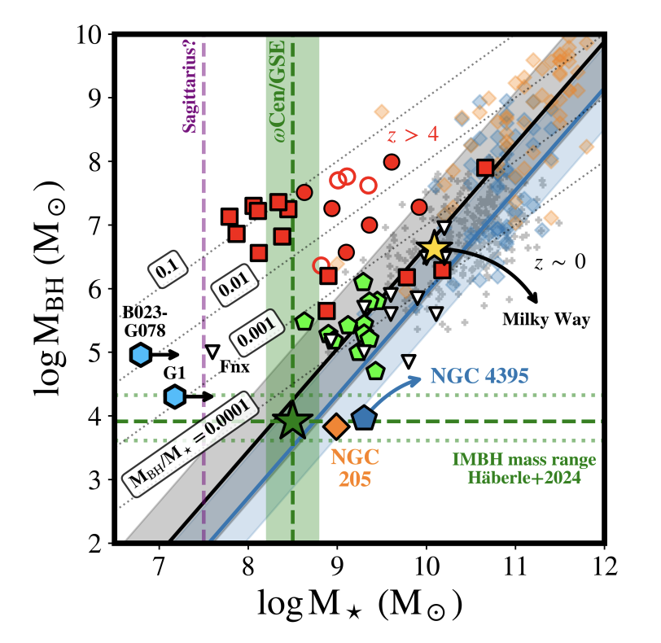

# Week 45
## Thu, 7 Nov
- [Unveiling the Binary Nature of NGC 2323](https://arxiv.org/abs/2411.03787) 秦松梅，钟靖，唐通，蒋悦悦（上台）
	- NGC 2323 (M50) 一直被认为是单星团，本工作从Gaia DR3 的 proper motion 认为这一星团内含两个成分，是一个没有被辨认出来的双星团。两者具有相同的年龄。
	- 用 PETAR N-体模拟，认为它们具有共同的起源，然后作为双星团互相绕行 ～200Myr。同时，模拟也表明，像这样质量较小的星团不太可能是银河系较差旋转产生的潮汐尾，而是真的双星团。

# Week 46
## Mon, 11 Nov
- 🤩[The Spider Stellar Engine: a Fully Steerable Extraterrestrial Design?](https://arxiv.org/abs/2411.05038) Clément Vidal(布鲁塞尔自由大学, 比利时)
	- 提出了**双星发动机模型**，并应用于候选系统蜘蛛脉冲星 **spider pulsars**（由一颗毫秒脉冲星和一颗极低质量伴星组成），并讨论了加速、减速、转向以及重力辅助或捕获等机动的潜在特征。
	- **恒星发动机 (stellar engine)**：当长寿文明的母星耗尽核燃料时，它必然要向附近的恒星迁移。实现这种迁移的一种方法是将其恒星转变为恒星发动机，并控制其在星系中的运动。
	- looking for technosignatures of stellar engines has taken two roads:
		- on the observational side, **hypervelocity stars** have been the target of such searches, but without good candidates 超高速恒星
		- on the theoretical side, stellar engine concepts have been proposed but are **poorly linked to observable technosignatures**
	- **双星发动机**：由于我们星系中大约一半的恒星都位于双星系统中，生命也可能发展，因此我们引入了双星发动机模型。

- [Emission Line Velocity, Metallicity and Extinction Maps of the Small Magellanic Cloud](https://arxiv.org/abs/2411.05523) Philip Lah, Matthew Colless, Francesco D'Eugenio
	- 使用澳大利亚国立大学(ANU) 的2.3米望远镜和广角光谱仪(WiFeS) 从多个角度测量了SMC的光学发射线，计算了gas-phase metallicity, extinction, H$\alpha$ radial velocity and H$\alpha$ velocity dispersion
		- **metallicity gradient**: from the centre to the north of the galaxy of $\sim -0.095\ \rm{dex/kpc}$  with a shallower metallicity gradient from the centre to the south of the galaxy of $\sim -0.013\ \rm{dex/kpc}$
		- **extinction gradient**: $\sim-0.086\ \rm{E(B-V)/kpc}$ from the centre going north and shallower going from the centre to the south of $\sim-0.0089\ \rm{E(B-V)/kpc}$

# Week 47
## Mon 18, Nov
- [The Last Arecibo Message](https://arxiv.org/abs/2411.09790) Kelby D. Palencia-Torres, César F. Quiñones-Martínez, Javier A. García Sepúlveda
	- The Arecibo Message was a brief binary-encoded communication transmitted into space from the Arecibo Observatory on November 16, 1974, intended to demonstrate human technological prowess.
	- 在2018年，为了纪念这条信息发出40周年，阿雷西博天文台发起了新阿雷西博信息竞赛，本文的 Boriken Voyagers 团队于 2020 年 8 月被认定为比赛获胜者。虽然比赛的主要目标是概念化而不是传递信息，但 2020 年 12 月阿雷西博望远镜的倒塌阻碍了任何后续的传输工作。
	- 在2024，为了纪念阿雷西博信息50周年，本文介绍了最初为阿雷西博望远镜开发的最后一条阿雷西博信息。
	- If the original message says "**we are a form of life reaching out to connect**", our message says "**we are ready to explore the universe together**." The prospect of transmitting this or a similar message remains an open question.

- [Discovery of a Rare Group of Dwarf Galaxies in the Local Universe](https://arxiv.org/abs/2411.10045) Sanjaya Paudel, Cristiano G. Sabiu, Suk-Jin Yoon
	- report the discovery of a **rare isolated group of five dwarf galaxies** located at **z = 0.0086 (D = 36 Mpc)** . 
	- All member galaxies are **star-forming, blue, and gas-rich** with g−r indices ranging from 0.2 to 0.6 mag, and two of them show signs of ongoing mutual interaction
	- The most massive member of the group has a stellar mass that is half of the Small Magellanic Cloud stellar mass
	- **有趣的地方**：Interestingly, **all galaxies found in the group are aligned along a straight line in the plane of the sky**. The observed spatial extent of the member galaxies is 154 kpc, and their relative line-of-sight velocity span is within 75 km s−1. Using the spatially resolved optical spectra provided by DESI EDR, we **find that three group members share a common rotational direction**.
	- 讨论了此类系统在矮星系群的形成和演化以及检验大尺度结构形成理论方面可能具有的重要性

## Tue, 19 Nov
- [The Black Hole−Stellar Mass Relation in the Dwarf-galaxy Regime with Gaia-Sausage/Enceladus and ωCentauri](https://arxiv.org/abs/2411.11251) Guilherme Limberg
	- 在银河系质量最大的球状星团 $\omega$Cen 中发现的高速星，为其中存在中等质量黑洞的假设提供了证据。
	- **content:** 
		- The discovery of fast moving stars in the Milky Way's most massive globular cluster, ωCentauri (ωCen), has provided strong evidence for an intermediate-mass black hole (IMBH) inside of it. 
		- However, ωCen is known to be the stripped nuclear star cluster (NSC) of an ancient, now-destroyed, dwarf galaxy. 
		- The best candidate to be the original host progenitor of ωCen is the tidally disrupted dwarf Gaia-Sausage/Enceladus (GSE), a former Milky Way satellite as massive as the Large Magellanic Cloud.
	- **method:**  
		- I compare ωCen/GSE with other central BH hosts and place it within the broader context of BH-galaxy (co)evolution. 
		-  I verify that ωCen (GSE), as well as other NSCs with candidate IMBHs and ultracompact dwarf galaxies, also follow the MBH−σ⋆ relation with stellar velocity dispersion.
	- **results:**
		- The IMBH of ωCen/GSE follows the scaling relation between central BH mass and host stellar mass (MBH−M⋆) extrapolated from local massive galaxies ($M⋆≳10^{10}M⊙$). Therefore, the IMBH of ωCen/GSE suggests that this relation extends to the dwarf-galaxy regime.

## Wed, 20 Nov
- [Estimating Dark Matter Halo Masses in Simulated Galaxy Clusters with Graph Neural Networks](https://arxiv.org/abs/2411.12629) Nikhil Garuda, John F. Wu, Dylan Nelson
	- **status:** accepted at the NeurIPS ML4PS 2024 workshop
	- 用图神经网络估计模拟星系团中的暗晕质量
	- **content:** Galaxies grow and evolve in dark matter halos. Because dark matter is not visible, galaxies' halo masses (Mhalo) must be inferred indirectly.
	- **method:** We present a graph neural network (GNN) model for predicting Mhalo from stellar mass (M∗) in simulated galaxy clusters using data from the IllustrisTNG simulation suite.
	- **results:** Unlike traditional machine learning models like random forests, our GNN captures the information-rich substructure of galaxy clusters by using spatial and kinematic relationships between galaxy neighbour. A GNN model trained on the TNG-Cluster dataset and independently tested on the TNG300 simulation achieves superior predictive performance compared to other baseline models we tested.

- [RR Lyrae Stars in Intermediate-age Magellanic Clusters: Membership Probabilities and Delay Time Distribution](https://arxiv.org/abs/2411.12741) Bolivia Cuevas-Otahola(墨西哥国立自治大学), Cecilia Mateu(乌拉圭共和国大学), Ivan Cabrera-Ziri
	- **content:** Recent works have challenged our canonical view of RR Lyrae (RRL) stars as tracers of exclusively old populations (≳10 Gyr) by proposing a fraction of these stars to be of intermediate ages (∼2-5 Gyr). 以前以为 RR Lyrae 是(≳10 Gyr)年老星族的示踪剂，但最近发现其中一小部分属于中等年龄(∼2-5 Gyr)
	- **aim:** Since it is currently not possible to infer stellar ages directly for individual RRL stars, our goal in this work is to search for these in association to intermediate-age clusters whose reliable ages can then be safely be attributed to the RRL. 因为没有办法直接计算单颗 RR Lyrae 的年龄，所以去看中等年龄星团，用星团的年龄去定RR Lyrae的年龄
	- **data:** used the **Gaia DR3 Specific Object Study** and **OGLE IV** public catalogues to search for RRL stars around stellar clusters **older than 1~Gyr** in the **Large and Small Magellanic Clouds**.
	- **results:**  
		- Modelling membership probabilities based on **proper motion and photometric distance** we obtained a list of **302 RRL stars** associated with Magellanic clusters.
		- Of these, **23 RRL** are likely members of **10 intermediate-age clusters**: 3 and 7 in the Small and Large Magellanic Clouds, respectively.
		- For the old population (>8 Gyr) we find $2.6^{+0.4}_{−0.3} RRL/10^5M⊙$. For the young (1-2 Gyr) and intermediate age (2-8 Gyr) populations we find rates of $0.9^{+0.3}_{−0.2}$ and $0.27^{+0.1}_{−0.09} RRL/10^5M⊙$, respectively.

## Thu, 21 Nov
- [A non-axisymmetric potential for the Milky Way disk](https://arxiv.org/abs/2411.12800) ZY. R. Khalil, B. Famaey, G. Monari
	- 银河系非轴对称引力势，利用GaiaDR3盘恒星的运动星系来调整银河系势能模型，包括棒和螺旋臂的详细参数，可以用来做银河系轨道积分之类的事

- [Empirical color correction to MIST and PARSEC isochrones on Gaia BR-RP and G-RP with benchmark open clusters](https://arxiv.org/abs/2411.12987) 王凡，房敏，符晓婷，陈洋
	- 观测到的Gaia星团CMD与理论模型等龄线(PARSEC)之间有颜色偏差，尤其在低质量端。量化了三个基准星团Hyades, Pleiades 和 的颜色(G-RP, BP-RP)偏差，给出了经验的校准函数，并将校准函数应用于31个额外的疏散星团和3个移动星团，显著改善了等龄线与观测CMD之间的一致性。通过我们的经验校正，等时线提供的年龄估计值与通过光谱锂耗竭边界方法获得的文献值一致，验证了我们方法的有效性。 PARSEC 1.2S 对应的金属度也与光谱结果表现出良好的一致性。

- [Revisiting the activity-rotation relation for evolved stars](https://arxiv.org/abs/2411.12994) Henggeng Han，王松，李学雪，郑传杰，刘继峰
	- 研究活动性和自传关系，给磁发电机机制提供insight

- [The temporal and spatial variations of lithium abundance in the Galactic disc](https://arxiv.org/abs/2411.13011) 孙天辰（向茂盛老师博后），毕少兰
	- 研究银盘上的锂丰度在空间和时间（利用年龄拐点MSTO）上的变化。
	- 锂丰度随恒星年龄的复杂变化：从 14 Gyr 逐渐增加到 6 Gyr，然后在 6 Gyr 和 4.5 Gyr 之间下降，此后迅速增加。我们发现年轻的富锂恒星（年龄<4 Gyr，A(Li) >2.7 dex）主要来自外盘。锂的银河系径向轮廓（相对于诞生半径）作为年龄的函数，显示出三个不同的时期：14-6 Gyr 前、6-4 Gyr 前和 4-1 Gyr 前。
	- 最初，锂丰度梯度为正，表明锂丰度随着诞生半径的增加而增加。在第二个时期，它转变为负的和破碎的梯度，主要受 Li-dip 恒星的影响。在最后一个时期，梯度恢复为正趋势。

- [HiFAST: An HI Data Calibration and Imaging Pipeline for FAST III. Standing Wave Removal](https://arxiv.org/abs/2411.13016) 徐晨，王杰，景英杰
	- 射电望远镜焦点和电磁波之间来回反射会形成驻波，利用FFT来消除驻波。pipeline中总结了各种驻波的情况和解决方法。发现了一些干扰的原因，8.1MHz是由于接收机的电磁干扰，后来21年把接收机放到了另一个电磁屏蔽的地方之后，FAST的数据质量就得到了大幅提高；0.5MHz可能是数字后段的干扰；0.37MHz可能是FAST另一个接收机带来的。

- [EWOCS-III: JWST observations of the supermassive star cluster Westerlund 1](https://arxiv.org/abs/2411.13051) M. G. Guarcello, V. Almendros-Abad, J. B. Lovell
	- 用DOLPHOT处理了 JWST观测的Westerlund1，在23.8mag星等极限完备性～50%（大致对应于 0.06 $M_\odot$棕矮星），够到的质量范围很低

- [SDSS J102915.14+172927.9: Revisiting the chemical pattern](https://arxiv.org/abs/2411.13096) E. Caffau (GEPI), P. Bonifacio (GEPI), L. Monaco (UNAB), M. Steffen (AIP)
	- 在非常低的金属丰度且年老的星中，没有看到碳。（是一件很罕见的事情，一般几乎没有铁的恒星中，怎么着都有碳）

- [Identifying the Galactic Substructures in 5D Space Using All-sky RR Lyrae Stars in Gaia DR3](https://arxiv.org/abs/2411.13122) Shenglan Sun, Fei Wang, Huawei Zhang, Xiang-Xiang Xue
	- 用RR Lyrae的5D数据来看银河系的子结构。
	- **data**: identify substructures in the Galactic halo using 46,575 RR Lyrae stars (RRLs) from Gaia DR3 with the photometric metallicities and distances newly estimated by Li et al. (2023).
	- **method**: Assuming a Gaussian prior distribution of radial velocity, we calculate the orbital distribution characterized by the integrals of motion for each RRL based on its 3D positions, proper motions and corresponding errors, and then apply the friends-of-friends algorithm to identify groups moving along similar orbits.
	- **results**: 
		- have identified several known substructures, including Sagittarius (Sgr) Stream, Hercules-Aquila Cloud (HAC), Virgo Overdensity (VOD), Gaia-Enceladus-Sausage (GES), Orphan-Chenab stream, Cetus-Palca, Helmi Streams, Sequoia, Wukong and Large Magellanic Cloud (LMC) leading arm, along with 18 unknown groups
		- indicate that HAC and VOD have kinematic and chemical properties remarkably similar to GES, with most HAC and VOD members exhibiting eccentricity as high as GES, suggesting that they may share a common origin with GES

## Fri, 22 Nov
- [A Glimpse at the New Redshift Frontier Through Abell S1063](https://arxiv.org/abs/2411.13640) Vasily Kokorev, Hakim Atek, John Chisholm
	- 5个 JWST 红移16-19的星系，非常高红移，可信度存疑，测光数据得到的，需要最终的光谱证认
	- report the discovery of **five galaxy candidates** at redshifts between **15.9<z<18.6** in JWST observations from the **GLIMPSE survey**, identified using a combination of Lyman-break selection and photometric redshift estimates
	- These galaxies have absolute magnitudes ranging from MUV=−17.7 to −18.0 mag, with UV continuum slopes between β≃−2.3 and β≃−3.0, consistent with young, dust-free stellar populations.
	- Overall, our results indicate that the luminosity distribution of the earliest star-forming galaxies could be shifting towards fainter luminosities, implying that future surveys of cosmic dawn will need to explore this faint luminosity regime.

- [Asymmetry of the tidal tails of open star clusters in direct N-body integrations in Milgrom-law dynamics](https://arxiv.org/abs/2411.13675) J. Pflamm-Altenburg
	- **MOND** : Modified Newtonian Dynamics 修正牛顿动力学，是一种用于解释引力作用的新理论框架。它的主要目的是在不需要假设暗物质的情况下，解释星系和星系团中异常的引力现象，尤其是在低加速度环境下（如星系的外部区域）。
	- **context** : 
		- Numerical QUMOND-simulations of star clusters orbiting in a Galactic disk potential show that the leading tidal arm of open star clusters contains tendentially more members than the trailing arm 在银河系盘势场中对疏散星团做的QUMOND数值模拟显示，疏散星团的潮汐前臂往往比后臂包含更多的成员
		- However, these type of simulations are performed by solving the field-equations of QUMOND and already become non-practical for star cluster masses at around 5000 Msun. 模拟通过求解QUMOND场方程进行，对质量在 5000$M_\odot$ 左右的星团已经不适用了
		- Nearby star clusters have masses of 1000 Msun or ~1000 particles and less/fewer and can currently not be simulated reliably in field-theoretical formulations of MOND. 近邻星团的质量为 1000$M_\odot$ 或 ～1000 粒子或更少，目前无法在MOND模型中进行可靠的模拟
	- **method** : In order to handle particle numbers below the QUMOND-limit the star cluster is simulated in **Milgrom-law dynamics (MLD)**: Milgrom's law is postulated to be valid for discrete systems in vectorial form.
	- **results** : 
		- It is found that the tidal tails of a low-mass star cluster are populated asymmetrically in the MLD-treatment, very similar to the QUMOND simulations of the higher-mass star clusters. 
		- In the MLD-simulations the leading tail hosts up to twice as many members than the trailing arm and the low-mass open star cluster dissolves approximately 25% faster than in the respective Newtonian case.

- [A study of the star clusters' population in the giant molecular cloud G174+2.5](https://arxiv.org/abs/2411.14235) T.A. Permyakova (UrFU), G. Carraro (UniPD), A.F. Seleznev (UrFU), A.M. Sobolev (UrFU), D.A. Ladeyschikov (UrFU), M.S. Kirsanova (Inasan)
	- 对巨分子云 G174+2.5 中的嵌埋星团，计算了星团的结构，**消光**，CMD，运动学和动力学状态
	- **data** : based on photometric data from the **UKIDSS** Galactic Plane Survey catalog and astrometric data from the **Gaia** DR3
	- **method** :
		- First, we recover all the known embedded clusters and candidate clusters in the region using surface density maps. 
		- Then, for the detected clusters, we determine their general parameters: the center positions, radii, number of stars, and reddening. 
		- To evaluate the reddening, we use both the NICEST algorithm and the Q-method. Both methods produce consistent extinction maps in the regions of the four studied clusters. However, the Q-method yields a much smaller color scatter in the CMD. For four clusters in particular (S235~North-West, S235~A-B-C, S235~Central, and S235~East1+East2), we were able to compute individual membership probabilities, the cluster distances, the cluster masses, and their average proper motions.
		- By building on these results, we have studied the clusters' kinematics and dynamics. 
		- Moreover, we estimate the mass of the gas component and the star formation efficiency (SFE) in the regions of these four clusters. 
		- Finally, we provide an estimate of the total energy of the stellar and gas components in the area of these four clusters to determine whether the clusters are bound (here we consider a 'cluster' as the system 'stars + gas').
	- **results** : The gravitational bound strongly depends on the region for which we estimate the gas mass. If we consider the mass of the entire cloud, all these four clusters turn out to be bound.