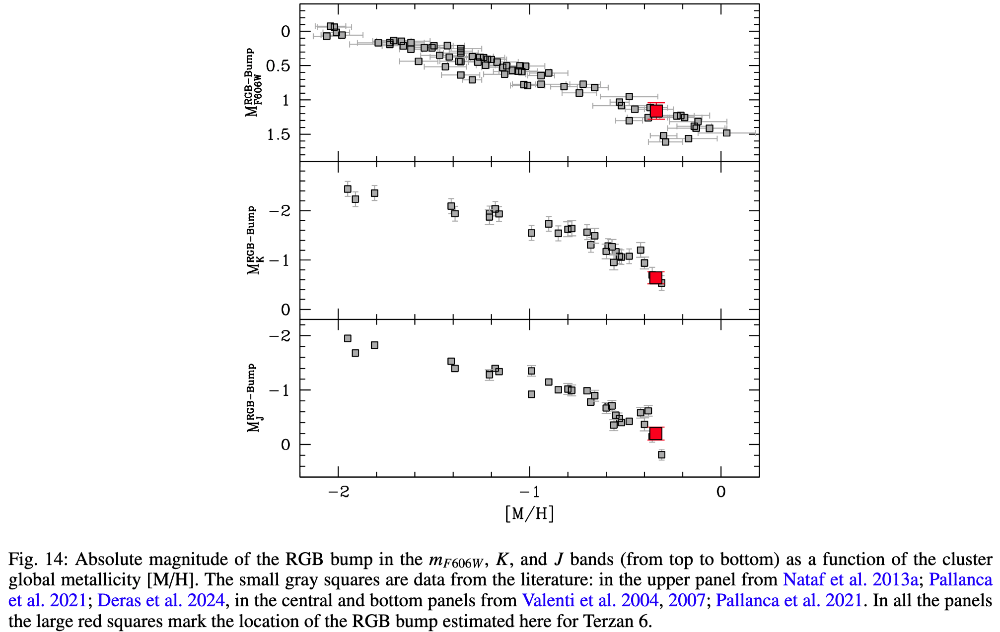

# Week 8
## 2025-02-19, Wed
1. [The bulge globular cluster Terzan 6 as seen from multi-conjugate adaptive optics and HST](https://arxiv.org/abs/2502.12247)
	**Authors**: Martina Loriga, Cristina Pallanca, Francesco R. Ferraro et al. **[INAF]**  
	对球状星团Terzan 6的首次详细的测光研究，Terzan 6 是核球中已知信息最少的球状星团之一。高角分辨率，多波段测光。光学和近红外的CMD，探测深度在主序拐点以下4个星等。改正了较差消光，做了King profile fitting。  
	新参数：$t=13\pm 1 \rm{Gyr}$, $\rm{E(B-V)}=2.36\pm 0.05$, $\rm{(m-M)_0}=14.46\pm0.1$, 对应距离 $\rm{d}=7.8\pm0.3\rm{kpc}$  
	**知识点**：红巨星支凸起**RGB bump**的绝对星等和星团**金属丰度**有关

2. [Vertical structure of an exoplanet's atmospheric jet stream](https://arxiv.org/abs/2502.12261)  
	**Authors**: Julia V. Seidel **[Chile, France]**, Bibiana Prinoth, Lorenzo Pino  
	**Status**: 🍃 Accepted for publication in [Nature](https://doi.org/10.1038/s41586-025-08664-1)  
	超热类木行星 Uptra-hot Jupiters，其昼夜两侧极端的温度对比带来了一个基本的气候难题：能量是如何分配的？构建了一个Global Circulation Models (CGM) 模型，来分析这类恒星的大气环流。

3. [Bow Shock and Local Bubble Plasma Unveiled by the Scintillating Millisecond Pulsar J0437−4715](https://arxiv.org/abs/2410.21390)  
	**Authors**: Daniel J. Reardon **[Australia]**, Robert Main, Stella Koch Ocker  
	**Status**: 🍃 submitted to Nature Astronomy  
	闪烁的毫秒脉冲星 J0437−4715 揭示了 bow 冲击波和Local Bubble等离子体。MeerKAT射电望远镜发现了位于毫秒脉冲星PSR J0437-4715方向的25个不同的等离子体结构，这些结构来自脉冲星及其风与周围星际介质相互作用所引发的一系列冲击波，一组出乎意料地有反向流动的现象，另21个展示了有Local Bubble内的湍流维持的结构有令人意外的丰富性。——Local Bubble被认为是一系列超新星在14Myr前爆炸导致的。

4. [Galactic magnetic fields II. Applying the model to nearby galaxies](https://arxiv.org/abs/2502.13029)  
	**Authors**: Rion Glenn Nazareth, Gayathri Santhosh, Luke Chamandy **[🇮🇳印度]**  
	星系磁场，观测和理论模型得到的磁场特性之间缺乏定量比较。基于 Paper I 提出的简单的轴对称银河动力学模型，将这个模型应用在M31, M33, M51, NGC 6946。  
	**相关参数**：方位角pitch angle、磁场强度和螺旋角radial profiles of azimuthally and vertically averaged magnetic field strength、气体速度色散gas velocity dispersion、标高scale height、湍流相关时间和长度turbulent correlation time and length、超新星遗迹的大小sizes of supernova remnants

5. [Ringworlds and Dyson spheres can be stable](https://arxiv.org/abs/2502.12806)  
	**Author**: Colin R McInnes **[格拉斯哥大学]**  
	**Status**: published in [MNRAS](https://doi.org/10.1093/mnras/staf028)
	在1856年的《亚当斯奖论文 Adams Prize essay》中，詹姆斯·克拉克·麦克斯韦展示了土星的环不可能由一个均匀的刚性物体组成。这是由于环与行星之间的双体引力相互作用导致的不稳定性。同样，根据牛顿的壳层定理，也已知所谓的包围单一恒星的戴森球会因其不稳定性而无法存在。本文报告了一个令人惊讶的发现，即**在受限三体问题中，环和球（壳）都可以是稳定的**。首先，如果考虑两个主要质量绕其共同质心轨道运动，那么一个大而均匀、无限小的环包围较小的质量，在*某些条件*下是可以稳定的。同样，如果戴森球包围*较小的主质量*，它也可以在某些条件下保持稳定。这些发现扩展了麦克斯韦关于环动力学的结果，并对科幻作品中的“环世界”和戴森球具有有趣的意义。此外，对于这种大尺度结构存在被动稳定轨道的发现，可能对寻找外星智能的科技信号研究具有重要启示。

## 2025-02-20, Thu
1. [Inconsistent metallicity spreads in first generation stars of globular clusters from high resolution spectroscopy and HST photometry](https://arxiv.org/abs/2502.13206)  
	**Authors**: Eugenio Carretta, Angela Bragaglia **[INAF-OAS bologna]**  
	高分辨率光谱和HST测光得到的球状星团第一代恒星的金属丰度分布不一致。  
	基于HST pseudo-colors map (PCM) 伪彩色图，近期有研究金属丰度分布异常地大，在颜色 $\rm{col} = m_\rm{F275W}-m_\rm{F814W}$ 上。许多球状星团推断出的金属丰度分布甚至超过了矮星系中观察到的分布，这和矮星系中恒星形成存在矛盾——矮星系的恒星形成跨度为billion years几十亿年，而球状星团恒星形成跨度一般是million years几百万年，这一矛盾通过对比两类天体中红巨星分支的宽度得到验证。此外，从伪色图推算出的第一代恒星的金属丰度分布总是大于通过光谱学测得的内在金属丰度分布。  
	**Method**: 使用了12个球状星团中30对第一代恒星，强调了色差Δcol的偏移与[Fe/H]差异的可变性之间的关系，差异可达到**0.2dex**，具体取决于星团。  
	**Results**:   
	- Providing for the first time quantitative measurements of the extension in Delta col of the sequences of FG and SG stars, we found no relation between metallicity spreads previously derived and extension of FG stars.   
	- We found that the length of the FG region correlates with the average global metallicity of GCs, and not with the observed metallicity spreads.   
	- The extension of FG stars also correlates with the extension of SG stars, and the global mass of the GCs.  
	**重要性**: Our findings seriously challenge the scenario claiming more inhomogeneous mixing among FG stars, invalidating previous speculations in the literature.

2. [Using detailed single star and binary evolution models to probe the large observed luminosity spread of red supergiants in young open star clusters](https://arxiv.org/abs/2502.13642)  
	**Authors**: Chen Wang(Postdoc),  Lee Patrick, Abel Schootemeijer, Selma E. de Mink **[MPIA]**  
	大质量恒星演化晚期会变成红超巨星 RSGs，最近的研究发现年轻疏散星团中的红超巨星的亮度范围比单星演化模型预期的要宽，可能解释之一是双星演化效应。对100Myr以内的星团，分析了其中3670个双星演化模型以及相应的单星模型。    
	**Results**:  
	- RSGs的光度范围在共生系统covel population中可以跨越十倍 a factor of ten  
	- 仅凭**双星效应无法解释**亮度达到当前单星模型预测的三倍的RSGs的数量  
	- 讨论了观测精度、旋转混合、年龄弥散以及RSG的内秉变化性等可能的解释  

3. [The RR Lyrae distribution in the Galactic Bulge](https://arxiv.org/pdf/2502.13650)  
	**Authors**: Roberto Capuzzo-Dolcetta **[罗马大学]**  
	RR Lyrae是重要的距离探针，希望检查球状星团的轨道衰减是否能导致银河系核球区的RR Lyrae分布。发现核区RR Lyrae分布有较大的不确定性，无法直接与理论模型比较。但是可以断言，在前景的RR Lyrae星中，有相当一部分来自轨道演化和已经溶解dissolved的球状星团

4. [PINN ME: A Physics-Informed Neural Network Framework for Accurate Milne-Eddington Inversions of Solar Magnetic Fields](https://arxiv.org/abs/2502.13924)  
	>ML, PINN, Solar  
	> **code**: https://github.com/RobertJaro/pinn-me
	  
	**Authors**: Robert Jarolim, Momchil E. Molnar, Benoit Tremblay **[高海拔天文台，美国]**
	太阳光测的光谱极化反演 Spectropolarimetric inversions of solar observations。基于PINN，在米尔恩-艾丁顿近似 Milne-Eddington approximation (PINN ME)下推断光球层磁场。模型作为参数空间的表示representation，映射输入坐标(t,x,y)到相应的光谱极化参数，这些参数用于合成斯托克斯蒲县。方法能找到最佳拟合米尔恩-艾丁顿参数集。同时，直接包括点扩散函数PSF。

## 2025-02-21, Fri
1. [Two categories of UV-upturn galaxies revealed by semi-analytic models](https://arxiv.org/abs/2502.14263)  
	>UV-upturn galaxies, IMF, semi-analytic model  
	  
	**知识点**：UV-upturn galaxies 特点是远紫外FUV波段光度异常增高，在一些椭圆星系和盘星系的核区被观察到。在半解析模型GABE中研究了UV-upturn galaxies，这个模型嵌入了极端水平支(EHB)星，EHB被认为是 UV-upturn 的关键候选。    
	分析了所有相关物理过程，包括stellar evolution, **initial mass functions (IMFs)**, dust attenuation, galaxy age, metallicity, and binary fractions，希望确定哪些过程在其中起到了重要作用。    
	**Results**:
	- 半解析模型中UV-upturn galaxies有两类，分别来自不同形成渠道
	- old metal-rich quenched elliptical galaxies, **intrinsic** UV-upturn galaxies induced by **EHB** stars within their old stellar populations
	- dusty star-forming galaxies, relatively young and may also be photometrically identified as UV-upturn galaxies when accounting for **dust attenuation**
	- IMF的大质量尾部对UV-upturn影响较小，普适的IMF对UV-upturn是够用的

2. [COSMIC-S: a photometric Catalogue of Observed Stars in the Small MagellanIc Cloud](https://arxiv.org/abs/2502.14470)  
	>SMC, Photometric Catalogue of star  
	>**Data**: ApJS
	
	**Authors**: A. Franco, A. A. Nucita, F. De Paolis, F. Strafella **[INAF]**  
	Dark Energy Camera (DECam) wide-field instrument mounted on the 4m V. Blanco Telescope (CTIO). 分析了2018年2月到2020年一月之间的对 SMC 的 DECam 图像，用 SExtractor 和 PSFx 做了PSF测光，目录有 10 971 906 个源，完备性在 22 mag，极限在 25 mag。

# Week 10
## 2025-02-24, Mon
1. [Boosting the growth of intermediate-mass black holes: collisions with massive stars](https://arxiv.org/abs/2502.14955)   
	>IMBH, dense cluster  
	
	**Authors**: Thomas W. Baumgarte, Stuart L. Shapiro  
	中等质量黑洞和大质量恒星的 head-on collision 正面碰撞模拟，这种碰撞一般发生在致密星团中，可能对种子黑洞的质量增长有重要作用。模拟显示大部分恒星质量会吸积到黑洞上，导致黑洞的快速增长，少量质量收到冲击加热，喷射成为星团中的星际物质。

2. [The Life and Times of Star-Forming Cores: an Analysis of Dense Gas in the STARFORGE Simulations](https://arxiv.org/abs/2502.15057)  
	>STARFORGE, gas simulation
	
	**Authors**: Stella S. R. Offner, Josh Taylor, Michael Y. Grudic  **[Uni of Texas at Austin, USA]**   
	在STARFORGE 模拟数据中识别致密云核并追踪其演化，无星云核starless core生命在0.5 - 0.6 Myr，原恒星云核 protostellar core生命在0.8 - 1.1 Myr，原恒星阶段持续时间在0.1Myr。

3. [Multi-Wavelength characterization of VVVX open clusters](https://arxiv.org/abs/2502.15114)
	>open cluster, VVVX
	
	**Authors**: C.O. Obasi, E. R. Garro, J.G. Fernández-Trincado  

## 2025-02-25, Tue

## 2025-02-26, Wed

# 2025-02-27, Thu

# 2025-02-28, Fri
